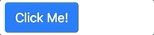
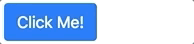

# ActivityButton

This component combines the `<activity-indicator>` and `<btn>` components all into one.

## Basic Usage
    <activity-button type="spinner" label="Click Me!"/>

    <activity-button type="dots">Click Me!</activity-button>

## Properties

## Computed

## Methods
