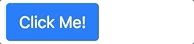
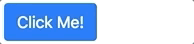

# BtnActivity

This component combines the `<activity-indicator>` and `<btn>` components all into one.

## Basic Usage
    <btn-activity type="spinner" label="Click Me!"/>

    <btn-activity type="dots">Click Me!</btn-activity>

## Properties

## Computed

## Methods
